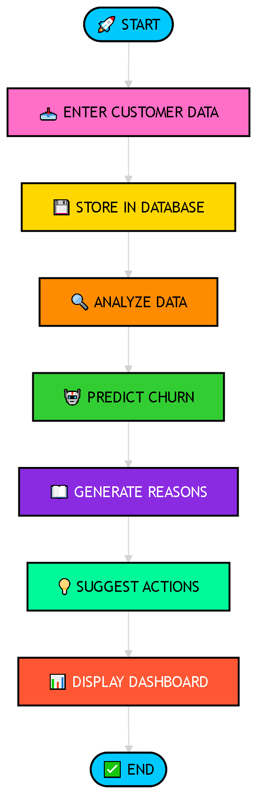
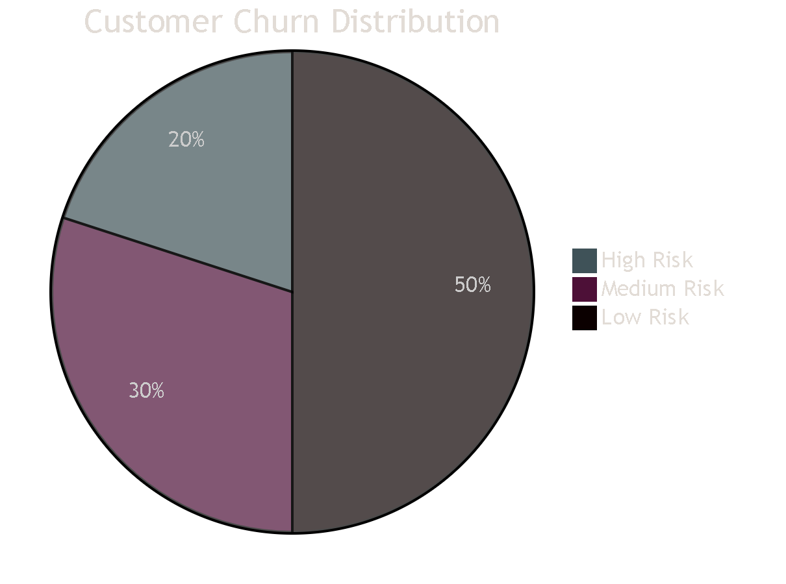
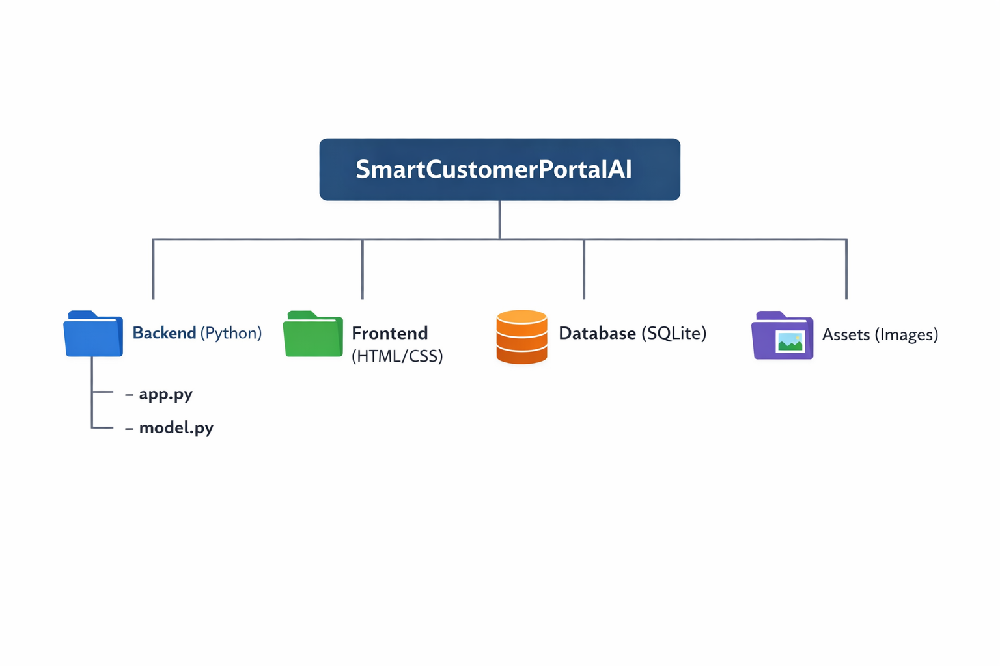

<div align="center">

<br>

# 📊 Smart Customer Management Portal — AI-Driven Insights System

### _Predict. Understand. Retain Customers Intelligently._

<br>

[](https://www.python.org)
[](https://flask.palletsprojects.com/)
[]
[]
[]
[]

---

<h3>🏆 An AI-powered system that <b>analyzes</b>, <b>predicts</b>, <b>explains</b>, and <b>recommends</b><br>to reduce customer churn in SaaS platforms.</h3>

<br>

| 📊 Manage Customers | 🤖 AI Prediction | 💡 Smart Recommendations |
|:---:|:---:|:---:|
| Add & track users | Detect churn risk | Get retention strategies |

</div>

<br>

---

## 📖 Table of Contents

- [Why This Platform?](#-why-this-platform)
- [Key Capabilities](#-key-capabilities)
- [System Architecture](#-system-architecture)
- [Process Flow](#-process-flow)
- [Insights Visualization](#-insights-visualization)
- [Technology Stack](#-technology-stack)
- [Project Structure](#-project-structure)
- [Quick Start](#-quick-start)
- [Deployment](#-deployment)
- [Team Members](#-team-members)
- [License](#-license)

---

## 🚀 Why This Platform?

Customer churn is one of the biggest challenges faced by SaaS companies. Businesses lose customers due to:

- Lack of early churn detection  
- Poor understanding of customer behavior  
- No actionable insights  

Most systems only store data but do not provide **intelligence**.

**This project solves that gap using AI-powered analytics.**


> **Result:** Businesses can reduce churn and increase customer retention using data-driven decisions.

---

## 🏆 Key Capabilities

<table>
<tr>
<td width="33%">

### 🤖 Intelligent Insights
- AI-based churn prediction  
- Customer health scoring  
- Behavior analysis  

</td>
<td width="33%">

### ⚡ Business Value
- Reduce customer loss  
- Improve retention strategies  
- Identify high-value customers  

</td>
<td width="33%">

### 🎨 User Experience
- Simple dashboard  
- Visual insights  
- Easy data management  

</td>
</tr>
</table>

---

## 🏗️ System Architecture

<div align="center">

</div>

## 🔄 Process Flow
<div align="center">

</div>

## 📊 Insights Visualization
<div align="center">

</div>

## 🛡️ Technology Stack

<div align="center">

| Layer | Technology | Purpose |
|:---|:---|:---|
| Backend | Python (Flask) | Application logic |
| Machine Learning | Scikit-learn | Churn prediction |
| Database | SQLite | Data storage |
| Frontend | HTML, CSS | User interface |
| Tools | Git & GitHub | Version control |

</div>

---

## 📁 Project Structure

<div align="center">

</div>

## ⚡ Quick Start

```bash
# Clone the repository
git clone https://github.com/BEC244993/H2H-PriyaDarshini-SmartCustomerPortalAI

# Navigate to project
cd H2H-PriyaDarshini-SmartCustomerPortalAI

# Install dependencies
pip install -r requirements.txt

# Run application
python app.py


